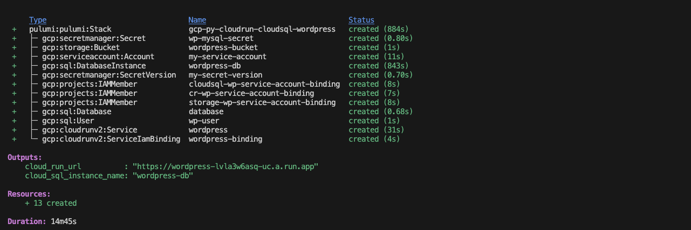
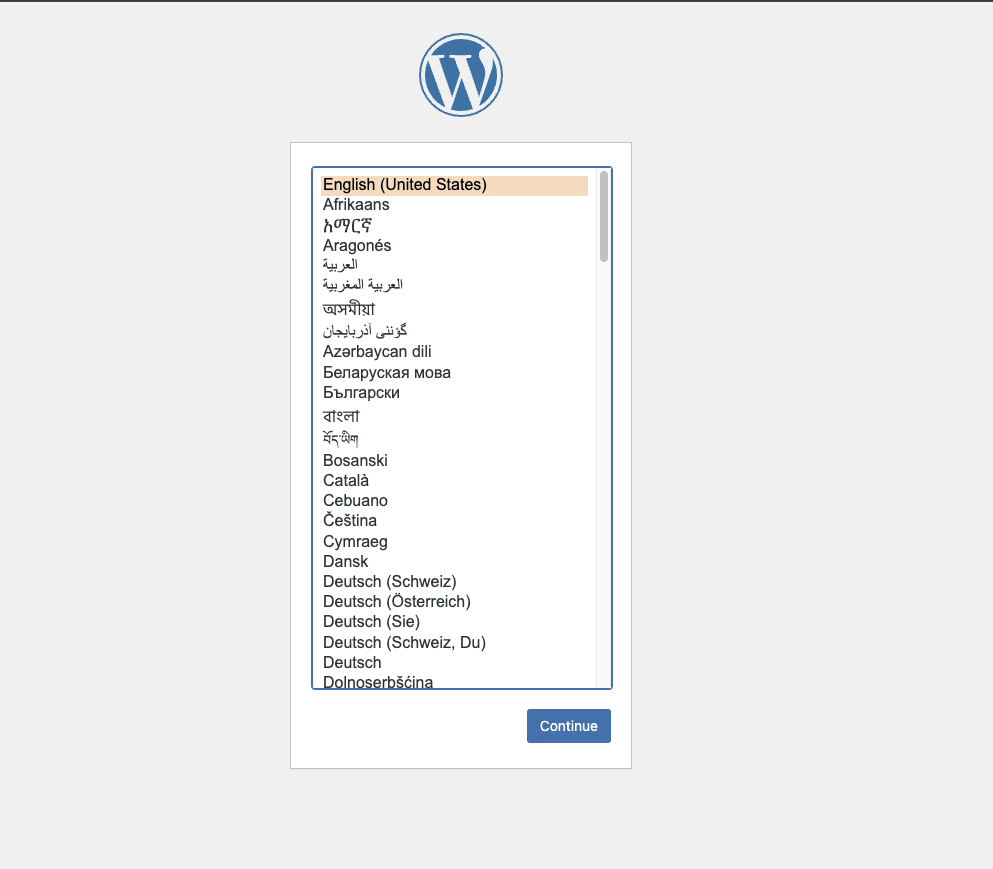

# Run Cloud Run on Wordpress (WIP)

This code will show you how to install a fresh [WordPress](https://wordpress.org "WordPress") installation on [Cloud Run](https://cloud.run "Cloud Run"). The WordPress application will live on Cloud Run while the data will be stored in a MySQL 8.0 database on [Google Cloud SQL](https://cloud.google.com/sql "Cloud SQL"). We will also store assets such as uploaded images in a [Cloud Storage](https://cloud.google.com/storage "Cloud Storage") bucket.

This will all be deployed utilizing [Pulumi](https://pulumi.com) as an IaC and [Python](https://python.org) language. 

## What is Cloud Run 
[Cloud Run](https://cloud.run "Cloud Run") is a container based platform that is entirely serverless. It is based on the [Knative Serving](https://knative.dev/docs/serving/ "Knative Serving") API and handles the scaling and deployment of your application without having to think about cluster, ingresses, etc. 


## What is WordPress?
[Wordpress](https://wordpress.org "Wordpress") is an open source Content Management System (CMS) written in PHP. It is said to run [40% of the internet](https://wordpress.org/40-percent-of-web/).

## What is Pulumi? 
[Pulumi](https://pulumi.com) is an open source Infrastructure-as-Code (IaC) tool that allows developers to use natural programming languages to declare and deploy cloud resource be it a public or private cloud.

## Preparing the Deploy

First we will need to set some environment variables

```bash
export PROJECT_ID=<your-project-id>
export REGION="us-central1" #or your preferred region
export ZONE=${REGION}-a 
export PROJECT_NUMBER=$(gcloud projects describe $PROJECT_ID --format='value(projectNumber)')
export GCE_SA="${PROJECT_NUMBER}-compute@developer.gserviceaccount.com"
```

### Configure that Google Cloud Platform (GCP) environment

Now that the variables are set, let's make sure that your GCP environment is setup and that your terminal is properly setup and authenticated to interface with GCP.

```bash
gcloud auth login 
gcloud config set project $PROJECT_ID 
gcloud config set compute/region $REGION
gcloud config set compute/zone $ZONE
gcloud auth application-default login
```

### Enable some Google Cloud APIs

Now that we are authenticated, let's enable some APIs. Every resource in Google Cloud has an API that needs to be enabled. By default, new projects have all APIs turned off so if you are just getting started, it's important to turn them on. You only need to do this once.

```bash
gcloud services enable \
        cloudresourcemanager.googleapis.com \
        compute.googleapis.com \
        container.googleapis.com \
        cloudbuild.googleapis.com \
        containerregistry.googleapis.com \
        storage.googleapis.com \
        run.googleapis.com
```

### Enabling Logs

And finally, we'll do set a few more environment variables and perform some IAM binding. In short, this will give our Cloud Run services the ability to write logs.


```bash
gcloud projects add-iam-policy-binding $PROJECT_ID \
--member=serviceAccount:${GCE_SA} --role=roles/storage.admin
gcloud projects add-iam-policy-binding $PROJECT_ID \
--member=serviceAccount:${GCE_SA} --role=roles/monitoring.metricWriter
gcloud projects add-iam-policy-binding $PROJECT_ID \
--member=serviceAccount:${GCE_SA} --role=roles/stackdriver.resourceMetadata.writer
```

Now that we have the basics setup, let's pull down the code

## Getting Started with Pulumi 


```bash
git clone https://github.com/jasonsmithio/pulumi-experiments
cd pulumi-experiments/serverless/cloud-run/cr-wordpress/
```

Now let's create a Pulumi stack. You can name the stack whatever you want but `wordpress` is a good stack name.

```bash
pulumi stack init
```

### Setting some Pulumi Variables

```bash
pulumi config set gcp:project $PROJECT_ID
pulumi config set gcp:region $REGION
pulumi config set db-name wordpress-db # You can change this if you really want to
pulumi config set cr-max 2 #You can set this to whatever number, minimum 1, default 2 if not set
pulumi config set db-tier db-f1-micro #You can set this to whatever number, default is db-f1-micro
```

Notice that some of these variables were set earlier. For the sake of the demo, we are only using 5 instances of Cloud Run. You could set it to 1 or you could set it way higher. Cloud Run, by design, will spin up as many instances as necessary to address the requests coming in. Setting a max creates a cap to help setup guardrails on spending and usage. 

In the same vein, we are using a `db-f1-micro` machine type for the MySQL database on Cloud SQL. The reason is because we want to reduce costs for this demo but if you needed/wanted a larger machine type, you can certainly choose. Type and pricing can be found [here](https://cloud.google.com/sql/pricing)

## Pulumi and Python

You will see that I have a `__main__.py` file in the main directory. This program will tell Pulumi todo a few things. 

- Import the relevant Python libraries ( lines 1-7 )
- Setup all the environment variables for later use ( lines 9-14 )
- It will create a bucket in Google Cloud Storage to store our WordPress assets. ( lines 16-22 )
- We will create a database password and store it as a secret in [Google Cloud Secret Manager](https://cloud.google.com/security/products/secret-manager) ( lines 24 - 44 )
- Create a CloudSQL instance, database and user ( lines 46-63 )
- Create a Google Cloud service account to be used by the Cloud Run instance to access Cloud SQL and Cloud Storage. ( lines 65-70 )
- Bind those storage accounts with the proper roles ( lines 72-92 )
- Create the Cloud Run service with the [Wordpress container](https://hub.docker.com/_/wordpress) while giving it relevant environment variables and setting up the SQL Connection and mounting the storage bucket ( lines 94-159 )
- In order to make the site publicly accessible, we will give `allUsers` the `run.invoker` role ( lines 161-169 )
- Output the SQL instance name and Cloud Run URL ( lines 171-1172 )

This is all Python code. We aren't using a bespoke Domain Specific Language (DSL) such as Hashicorp's HCL. Since this is just Python, it is really easy to add to your workflow. 

## Let Pulumi build you resources!

We will execute now let Pulumi take our Python program and deploy.

```bash
pulumi up
```
It will run a test first to make sure that everything looks good. After that test runs, it will ask you if you want to execute so choose `yes` and deploy. This can take a 10-15 minutes to complete (most of it is building the database) but I want you to take notice of how long it takes the `wordpress_cr_service` to run.



*Note* the `Outputs`. You should see `cloud_run_url`. Copy that as we will need it for the next step. 

## Log Into The Site

We will now go to our web browser and navigate to the `cloud_run_url` that we collected earlier.



We will setup WordPress. It's pretty straightforward, setup a language, username, password, etc. Once complete, navigate back to the URL and you should see your site. If you add `/wp-login.php` to the end of the URL, you can use your username and password to sign into the WordPress CMS and configure the site. 

## (Optional) Add a Load Balancer with nip.io wildcard DNS

Right now, traffic is coming to your 

```bash
pulumi config set --type bool use_gclb true
```

## Clean Up

Best practices are to always clean up after your experiments. Simply enter the below command.

```bash
pulumi destroy
```

choose `yes` to destroy and in about 5 - 10 minutes, everything will be removed. 

## TODO 
GCLB with Cloud CDN support